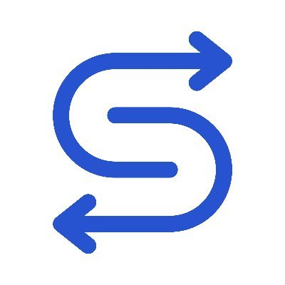

<!-- PROJECT LOGO -->
 

  

  <h3 align="center">Serai</h3>

  

    Cross-Chain Decentralised Exchange
     
     
    <a href="https://serai.exchange/">Try it out</a>
  

<!-- TABLE OF CONTENTS -->

  
Table of Contents

  <ol>
    <li>
      <a href="#about">About</a>
      <ul>
        <li><a href="#repository-layout">Repository Layout</a></li>
      </ul>
    </li>
    <li>
      <a href="#getting-started">Getting Started</a>
      <ul>
        <li><a href="#prerequisites">Prerequisites</a></li>
        <li><a href="#setting-up-locally">Setting up locally</a></li>
      </ul>
    </li>
    <li><a href="#Links">Links</a></li>
  </ol>

## About

Cross-chain DEX premised on decentralized threshold multisigs
Serai is a new DEX, built from the ground up, initially planning on listing
Bitcoin, Ethereum, DAI, and Monero, offering a liquidity-pool-based trading
experience. Funds are stored in an economically secured threshold-multisig
wallet.

Serai is a decentralized execution layer whose validators form multisig wallets
for various connected networks, offering secure decentralized control of foreign
coins to applications built on it.

Serai is exemplified by Serai DEX, an automated-market-maker (AMM) decentralized
exchange, allowing swapping Bitcoin, Ether, DAI, and Monero. It is the premier
application of Serai.

Serai is based on [Substrate](https://docs.substrate.io), a blockchain framework
offering a robust infrastructure.

[Getting Started](docs/Getting%20Started.md)

### Layout

- `audits`: Audits for various parts of Serai.

- `docs`: Documentation on the Serai protocol.

- `common`: Crates containing utilities common to a variety of areas under
  Serai, none neatly fitting under another category.

- `crypto`: A series of composable cryptographic libraries built around the
  `ff`/`group` APIs achieving a variety of tasks. These range from generic
  infrastructure, to our IETF-compliant FROST implementation, to a DLEq proof as
  needed for Bitcoin-Monero atomic swaps.

- `coins`: Various coin libraries intended for usage in Serai yet also by the
  wider community. This means they will always support the functionality Serai
  needs, yet won't disadvantage other use cases when possible.

- `processor`: A generic chain processor to process data for Serai and process
  events from Serai, executing transactions as expected and needed.

- `coordinator`: A service to manage processors and communicate over a P2P
  network with other validators.

- `substrate`: Substrate crates used to instantiate the Serai network.

- `deploy`: Scripts to deploy a Serai node/test environment.

## Getting Started

### Links

- [Discord](https://discord.gg/mpEUtJR3vz): https://discord.gg/mpEUtJR3vz
- [Github](https://github.com/serai-dex): https://github.com/serai-dex
- [Mastodon](https://cryptodon.lol/@serai): https://cryptodon.lol/@serai
- [Matrix](https://matrix.to/#/#serai:matrix.org): https://matrix.to/#/#serai:matrix.org
- [Reddit](https://www.reddit.com/r/SeraiDEX/comments/vk0arr/rseraidex_lounge/): https://www.reddit.com/r/SeraiDEX/comments/vk0arr/rseraidex_lounge/
- [Telegram](https://t.me/SeraiDEX): https://t.me/SeraiDEX
- [Twitter](https://twitter.com/SeraiDEX): https://twitter.com/SeraiDEX
- [Website](https://serai.exchange/): https://serai.exchange/
