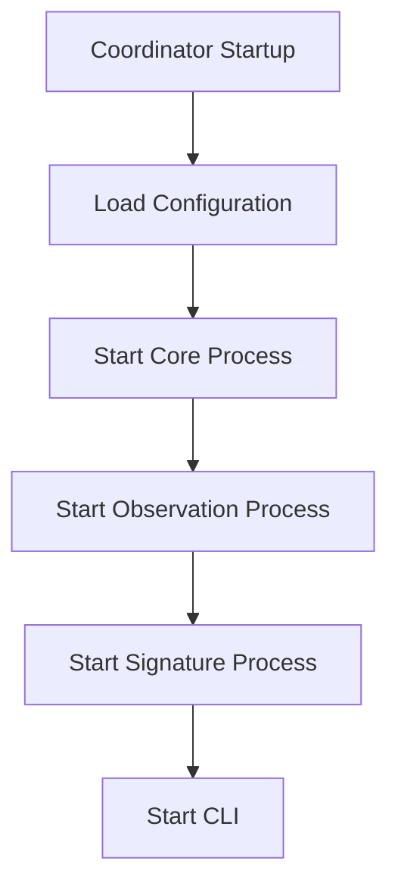
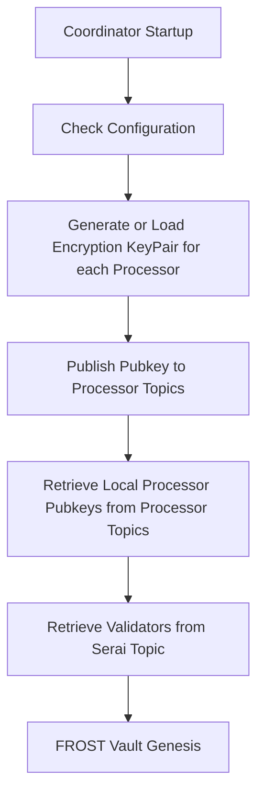

# Coordinator

The Coordinator is a service that coordinates the processor infrastructure to prepare and submit instructions into the Serai blockchain and relay consensus-driven instructions from the Serai blockchain to the various processors. Other responsibilites of the coordinator include:

*   Managing the lifecycle of the processor infrastructure.
*   Proxying communications between internal and external processors for collaborative signing.
*   Ensuring data integrity with information going to and from the blockchain.
*   Provide necessary data for frontend consumption.

## Build, Run, Test

TBA

## Requirements

* A service that coordinates processors with:
  * A core process with:
    * Configuration for multiple environments (local,test,prod) containing:
    * Information as to what chains are enabled for a local environment.
    * Network interface information for local services:
      * Serai (for outbound rpc events)
      * Kafka (for internal events)
  * A observation process with:
    * Consumer that processes all events deposited by Serai producer.
    * Consumer for observed txin instructions.
    * Consumer for observed txout instructions.
  * A signature process with:
    *  Deterministic selection of signature party members from a given validator set.
    *  Secure network communication capabilities with foreign network party members.
    *  Encrypted extraservice communication capabilities with local network processors.

## General Architecture

Serai Coordinator uses Apache Kafka as a message bus to communicate between the processors and coordinator of the local Serai deployment. Through the use of Kafka topics, the coordinator can route/receive messages to/from the appropriate area of our service cluster.

Topics:

* `name-chain` - Observations from the Serai blockchain.
* `name-serai` - Observations from chains registered by the Serai Coordinator.

Within the coordinator we have processes, each process will be responsible for one or more producers, and may be responsible for one or more consumers, all running on separate threads. Through initialization, the process will create the appropriate kafka producers and consumers, and then start them on their own threads.

### Coordinator Runtime Responsibilities

*   Monitor the Serai blockchain for new instructions.
*   Regularly validate solvency of multisignature vaults.
*   Provide public data to a topic destined for consumption by a frontend/datawarehouse service.

### Main


***Runtime Arguments*** - The coordinator will accept the following runtime arguments:

*   --config_dir - The path to the configuration file.
*   --mode - The mode of the coordinator (production, development, test).
*   --name - The identity of the keys responsible for the runtime coordinator.

**Load Configuration** - The coordinator will load the configuration file that contains the necessary information to start the coordinator. Configuration is setup to faciliatate multiple orchestration environments (Development, Test, Production).

**Start Core Process** - The coordinator will start the core process, which is responsible for managing the lifecycle of the coordinator infrastructure and utility functions.

**Start Observation Process** - The coordinator will start the observation process, which is responsible for observing the serai topic for all new relevant events for maintenance and relay to the appropriate endpoint.

**Start Signature Process** - The coordinator will start the signature process, which is responsible for coordinating the signing of transactions with external coordinators and internal processors.

**Start CLI** - The coordinator will start the CLI, which is responsible for providing a command line interface for the coordinator.

## Core Process

### Requirements
* Configuration loading and management.
* Logger setup, management, and consumption.

### Configurations

Configuration is handled through a configuration file that is loaded on startup. The configuration file is a TOML file that contains the following sections:

* general
  * log_level - The log level to use for coordinator console logging.
  * backup_dir - The directory to store backups in.
  * backup_interval - The interval to backup the coordinator state.
* chains
  * enabled
  * rpc
* kafka
  * kafka_host
  * kafka_port
  * offset_reset
* observation
  * rpc_host
  * rpc_port
* network
  * temporary array for party member names


### Keygen

To form a multisignature vault after validators have been elected to be a part of an upcoming set update, the coordinator will send this list of validators and the corresponding set and coin to the keygen processor. The coordinator will then form secure connections to each set member and send the keygen party to the validators. The validators will then sign the keygen party and send the signed keygen party back to the keygen processor. Once the processor has received the required number of signatures, it will send the succesfully generated public keys to the coordinator. The coordinator will then send the key and necessary metadata to the serai layer for publishing. The serai layer will then publish a vault update in the blockchain that will be considered active after the set succesfully updates. 


## Observation Process

### Requirements

* Observe blockheight update events on the target blockchain.
* Observe instruction events to addresses of interest on the target blockchain.

### Architecture

The observation module is responsible for observing the target blockchain for events of interest. It is responsible for publishing these events to the appropriate Kafka topic. To do this, we will continuously poll the local RPC endpoint for changes or information of interest. Once the information has been captured from the target blockchain, it will be published to the appropriate Kafka topic.

The module will provide a process with an initialization method that requires the rpc endpoint at instatiation. Once initialized, the manager will then spawn a thread that will use subxt to subscribe for all events. The manager will also provide a method to stop the event subscription thread. If the chainstate has changed, the manager will produce an update to the chainstate on the appropriate Kafka topic. In the polling operation there will also be a check to determine if there are any events of interest that have occurred on the target blockchain. If there are events of interest such as "Instructions", the process will publish the event to the appropriate Kafka topic so that downstream consumers can process. The observation module uses a custom polling consumer model, not a kafka message consumer.

### Signature Process
Serai's custom FROST library has keygen state machine that accepts shares until error or a cryptographic key is generated. These signature shares must accumulate shares in hashmap then when threshold reached, a transaction will be generated that can be relayed to the appropriate chain. Generating a signature share is a two-step process, first each signing party member must exchange commitments with eachother, then they must send shares to eachother based on these commitments.

### Requirements

* Proxy messages to processors for key generation.
* Proxy messages to processors for signing.

#### Signature Process Startup



**Generate or Load KeyPair** - The coordinator will generate a keypair or load a keypair to/from environment variables. In a production environment this will be replaced by a proper key management system and secrets provider. The keypair generated will be used to encrypt and decrypt messages between the coordinator and the processors.

**Retrieve Local Processor Keys** - The coordinator will retrieve the keypairs from the local processors from each configuration enabled coin. The processor public keys will be revealed to other validators during the multisignature keygen and signing processes.

**Retrieve/Test Connect Validators** - The coordinator will retrieve the validators from the running Serai node and create test/identity connections with each validator in the hashmap.

**Genesis Vault** - The coordinator will generate the genesis vault from using the multisignature keygen process later detailed.


### Party Formation

Signing party, use last Serai blockhash to randomly select the threshold amount of validators needed to sign the transaction. The coordinator will then send a message with this list to the processor to start the transaction signing procedure. The coordinator will then wait for the processor to sign the transaction. the coordinator will monitor the transaction, and report the output hash once the threshold amount of validators have signed the transaction.

```
let rng = Chacha20Rng::from_seed(block_hash); loop { rng.next_u64() % VALIDATOR_COUNT + 1; }
```

## Network Process

### Requirements

* Accept requests from other processes to secure connections with a specific list of addresses.
* Consume inbound messages and publish them securely to the appropriate Kafka topic.

The connection module is responsible for establishing secure connections with a list of validators. It will accept requests to establish connections with a list of validators, and then will attempt to establish secure connections with each validator. Once a secure connection has been established, the connection module will publish a messages provided from the CryptoManager to target validators. The connection module will also consume messages from the appropriate Kafka topic, and then will publish the message to the appropriate validator. 

```mermaid
    graph LR;
    subgraph MessageFlow
    subgraph Alice
    ABP["Processor (BTC)"]-->ABK["Kafka BTC Topic"]-->AC["Coordinator"];
    AC["Alice Coordinator"]-->AST["Kafka Serai Topic"]-->ASN["Alice Serai Node"];
    end
    subgraph Bob
    BBP["Processor (BTC)"]-->BBK["Kafka BTC Topic"]-->BC["Coordinator"];
    BC["Bob Coordinator"]-->BST["Kafka Serai Topic"]-->BSN["Bob Serai Node"];
    end
    ABP --> ABK ==> AC<-. Coordinators communicate over libp2p. .-> BC --> BBK ==> BBP
    BBP --> BBK ==> BC-.-AC ==> ABK ==> ABP
    end
```